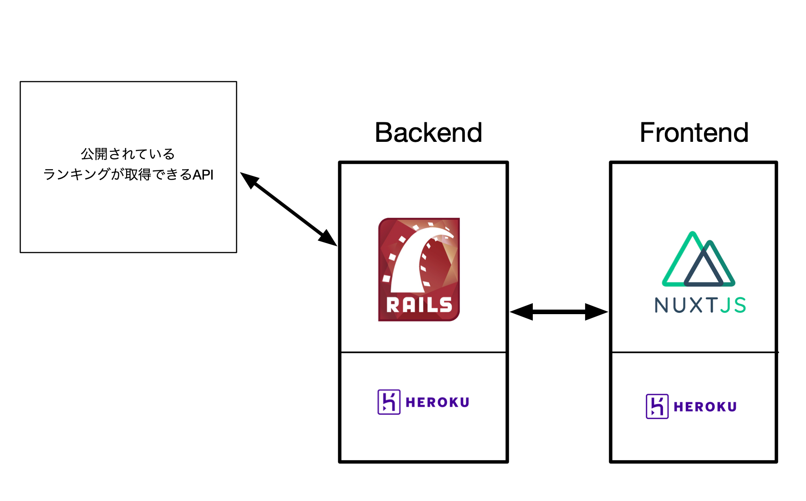

# PannelBreak

## サービスURL
どちらでもアクセスできます。

https://peraichi.com/landing_pages/view/pannelbreak
( https://pannel-break.herokuapp.com/ )

## 製品概要
### Communication × Quiz × Tech

### 背景（製品開発のきっかけ、課題等）
- 今回のプロダクトの開発に至った背景

昔あったとあるランキング形式のクイズ番組から着想を得ました。
ECサイトが普及したことから、商品のリアルタイムの人気の度合いを取得できると考え、それをクイズに用いることで、より楽しいリアルタイム性のあるクイズアプリができるのではと考えました。

- 着目した顧客・顧客の課題・現状

このアプリはよくあるアイスブレイクの場に使えるのではないかと考えています。アイスブレイクは、その場を仕切るファシリテーターのスキルがなければ、参加者の仲が深まることが難しいと思います。そこでこのアプリを使うと、まだ相手のことを知らない中で、一緒にクイズを考えることで自然と仲が深まるきっかけになると考えています。

### 製品説明（具体的な製品の説明）
テーマに沿ったランキングを予想して９つのパネルを正解で埋めていくゲーム。ランキングはweb上のデータによりリアルタイムで変化している。同じテーマでも昨日と今日ではランキングが変わっていることがあるため繰り返しゲームを楽しめる。複数人で遊ぶと盛り上がるため飲み会やレクリエーション等で利用してみて。
### 特長

#### 1. 飽きない：リアルタイムで変化するランキングクイズの為毎日楽しめます。加えてクイズテーマも豊富にできるので自分の知見も増やせるかもしれません。

#### 2. 楽しい：メディア等でよく見るランキングクイズを再現しているつもりなので楽しくないわけないです。1人より2人、2人より３人の方が盛り上がります。

#### 3. 売れる：今回私たちが制作したプロダクトでは商品の売り上げを基にランキングクイズを作成しています。そのため企業側からすれば売れ筋商品をアピールしていることになるため顧客の購買意欲向上を促進する効果があると思います。

### 解決出来ること
私たちは最終的に初対面の人同士が仲良くなれるようなプロダクト作成を目指しています。私たちのプロダクトで遊ぶことでクイズを通して一体感が生まれたり、ランキングの内容について語り合うことで相手のパーソナリティを垣間見るきっかけになります。

### 今後の展望
- オンライン機能

    → オンラインにすることで離れた人とボイスチャットをしながら盛り上がれる

- チーム対戦機能を実装する
    
    → 対戦形式にすることで、一体感がより得られると考えよりコンセプトに沿ったプロダクトになるのではないかと考えた。

- ヒント機能を用意する

    → 全くランキングが分からない時に、話のきっかけとなるようなヒント機能を用意したい

## 開発内容・開発技術
Webアプリの開発

### 活用した技術

### 研究内容・事前開発プロダクト（任意）
特になし

### 独自開発技術（Hack Dayで開発したもの）
#### 2日間に開発した独自の機能・技術
* 独自で開発したものの内容をこちらに記載してください
* 特に力を入れた部分をファイルリンク、またはcommit_idを記載してください（任意）
